# Knowledge-base pipeline diagram (A2)

```mermaid
flowchart LR
    subgraph S1["Stage 1 - Ingest & Enhance"]
        A["data/raw PDF"] --> B["pypdfium2 render 200 DPI"]
        B --> C["denoise / Otsu binarize / deskew"]
        C --> D["CLAHE + unsharp / UNet denoiser"]
    end
    subgraph S2["Stage 2 - Layout"]
        D --> E["morphology close"]
        E --> F["connected components + merge"]
        F --> G{"classify"}
        G -->|"ruling lines or >=2 whitespace columns"| T["table"]
        G -->|"ink density"| F2["figure"]
        G -->|"small edge block"| H["heading"]
        G -->|"else"| TXT["text"]
    end
    subgraph S3["Stage 3 - OCR"]
        TXT --> O["RapidOCR PP-OCRv4-onnx, canvas 1280"]
        T --> O
        H --> O
        F2 --> O
        O --> OC[("per-page OCR cache")]
        OC --> R3["lines -> regions -> Chunk per region"]
    end
    subgraph S4["Stage 4 - Index"]
        R3 --> CH["chunk 256 tok / 32 overlap"]
        CH --> E4["all-MiniLM-L6-v2 384-d, normalized"]
        E4 --> IX[("FAISS IndexHNSWFlat (inner product) + chunks.jsonl sidecar")]
    end
    IX --> RET["Stage 5 - dense retrieval: cosine top-k -> Chunk.score"]
    RET --> AG["Stage 6 - agent loop with evidence-gated re-search (A3)"]
```

Text form: **pages → clean → (enhance) → layout → OCR → chunk → embed → store**.

Notes on what changed from the default:
- **Enhancement** runs classical CLAHE+unsharp by default (`enhance.model: clahe_denoise`); a
  from-scratch UNet denoiser is implemented (`unet_small`) and trainable, but is off by default
  on CPU.
- **OCR backend** is RapidOCR PP-OCRv4-onnx — the published pretrained PP-OCR detection +
  recognition models exported to ONNX and served by onnxruntime. PaddleOCR PP-OCRv5 was blocked
  by the paddlepaddle 3.3.1 CPU crash.
- **Index type** is FAISS `IndexHNSWFlat`, built with `METRIC_INNER_PRODUCT` (not FAISS's default
  L2) so retrieval scores are cosine similarities, consistent with the normalized embeddings from
  Stage 4. Chunk metadata (id/doc_id/text/page_ids) is persisted alongside as a JSONL sidecar
  (`chunks.jsonl`), since FAISS itself only stores vectors — kept in sync with the index by row
  order. Chosen over a hosted vector DB for a fully local, free, dependency-light setup at this
  corpus scale.
- All intermediates are cached under `data/interim/` so rebuilds are incremental and the
  reproducibility gate holds.